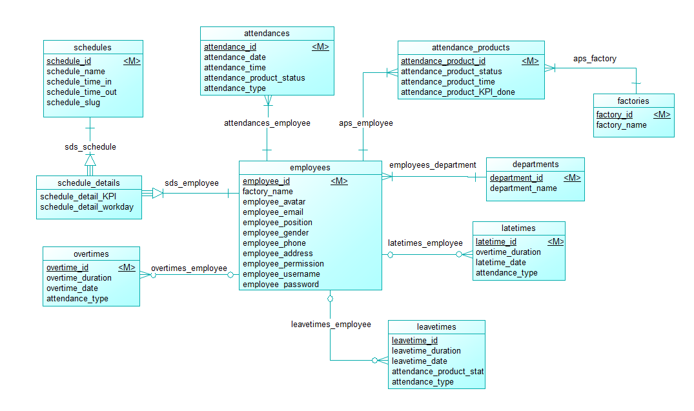

# 📌 Attendance Management System

## 📝 Introduction
This project is an attendance management system designed for enterprises to track working hours, shifts, overtime, and employee-related data. The system efficiently manages employee information, work schedules, attendance, overtime, and leave records. Additionally, it utilizes **⚡ TCP Socket** to collect attendance data from biometric devices.

## 🏗️ Main Components

### 📌 Conceptual Data Model (CDM)
Below is the conceptual data model (CDM) for the system:



### 👨‍💼 1. Employees (`employees`)
| 🆔 Column Name            | 🗄️ Data Type  | 📌 Description                       |
|------------------------|-----------|-----------------------------------|
| `employee_id`         | INT (PK)  | Unique identifier for employees  |
| `factory_name`        | VARCHAR   | Factory name of the employee     |
| `employee_avatar`     | VARCHAR   | Profile picture of the employee  |
| `employee_email`      | VARCHAR   | Email address                    |
| `employee_position`   | VARCHAR   | Job position                     |
| `employee_gender`     | VARCHAR   | Gender                           |
| `employee_phone`      | VARCHAR   | Contact number                   |
| `employee_address`    | TEXT      | Address                          |
| `employee_permission` | VARCHAR   | User permission level            |
| `employee_username`   | VARCHAR   | Username for login               |
| `employee_password`   | VARCHAR   | Encrypted password               |

### 🕒 2. Attendance (`attendances`)
| 🆔 Column Name                | 🗄️ Data Type  | 📌 Description                           |
|----------------------------|-----------|---------------------------------------|
| `attendance_id`           | INT (PK)  | Unique identifier for attendance     |
| `attendance_date`         | DATE      | Date of attendance                   |
| `attendance_time`         | TIME      | Time of attendance                   |
| `attendance_status`       | VARCHAR   | Status of check-in/out               |
| `attendance_type`         | VARCHAR   | Type of attendance                   |

### 📦 3. Attendance Products (`attendance_products`)
| 🆔 Column Name                         | 🗄️ Data Type  | 📌 Description                        |
|-------------------------------------|-----------|------------------------------------|
| `attendance_product_id`            | INT (PK)  | Unique identifier                  |
| `attendance_product_status`        | VARCHAR   | Status of attendance product       |
| `attendance_product_time`          | TIME      | Time logged for product attendance |
| `attendance_product_KPI_done`      | INT       | KPI completed status               |

### 📅 4. Work Schedules (`schedules`)
| 🆔 Column Name          | 🗄️ Data Type  | 📌 Description             |
|----------------------|-----------|-------------------------|
| `schedule_id`       | INT (PK)  | Unique schedule ID      |
| `schedule_name`     | VARCHAR   | Name of the schedule    |
| `schedule_time_in`  | TIME      | Start time              |
| `schedule_time_out` | TIME      | End time                |
| `schedule_slug`     | VARCHAR   | URL-friendly identifier |

### ⏳ 5. Overtime (`overtimes`)
| 🆔 Column Name         | 🗄️ Data Type  | 📌 Description                 |
|---------------------|-----------|-----------------------------|
| `overtime_id`      | INT (PK)  | Unique identifier           |
| `overtime_duration`| TIME      | Duration in hours           |
| `overtime_date`    | DATE      | Date of overtime            |
| `overtime_type`    | VARCHAR   | Type of overtime            |

### ⏰ 6. Late Times (`latetimes`)
| 🆔 Column Name         | 🗄️ Data Type  | 📌 Description                |
|---------------------|-----------|----------------------------|
| `latetime_id`      | INT (PK)  | Unique identifier          |
| `latetime_duration`| TIME      | Duration in minutes        |
| `latetime_date`    | DATE      | Date of late attendance    |
| `latetime_type`    | VARCHAR   | Type of late               |

### 🚪 7. Leave Times (`leavetimes`)
| 🆔 Column Name          | 🗄️ Data Type  | 📌 Description            |
|----------------------|-----------|------------------------|
| `leavetime_id`      | INT (PK)  | Unique identifier      |
| `leavetime_duration`| TIME      | Duration of leave      |
| `leavetime_date`    | DATE      | Date of leave          |
| `leavetime_status`  | VARCHAR   | Leave status           |

## ⚡ TCP Socket Integration
- The system integrates **TCP Socket communication** to receive real-time attendance data from biometric devices.
- The attendance records are automatically stored in the database upon receiving data from the device.

## 🔗 Relationships Between Components
- Each employee belongs to a department and works in a factory.
- Each employee can have multiple attendance, overtime, late time, or leave time records.
- Each work schedule can have multiple schedule details.

## 🛠️ Technologies Used
- **Backend:** Laravel 10, PHP 8
- **Database:** MySQL
- **Frontend:** JQuery, Bootstrap
- **Communication Protocol:** TCP Socket for biometric device data transfer

## 🚀 Installation Guide
1. Clone the repository:
   ```sh
   git clone https://github.com/Niks890/AttendanceSystemTST.git
   ```
2. Install dependencies:
   ```sh
   composer install
   npm install
   ```
3. Configure the `.env` file and set up the database.
4. Run migrations to create database tables:
   ```sh
   php artisan migrate
   php artisan db:seed
   ```
5. Start the development server:
   ```sh
   php artisan serve
   ```

## 🤝 Contribution
If you would like to contribute, please fork the repository and submit a pull request.
